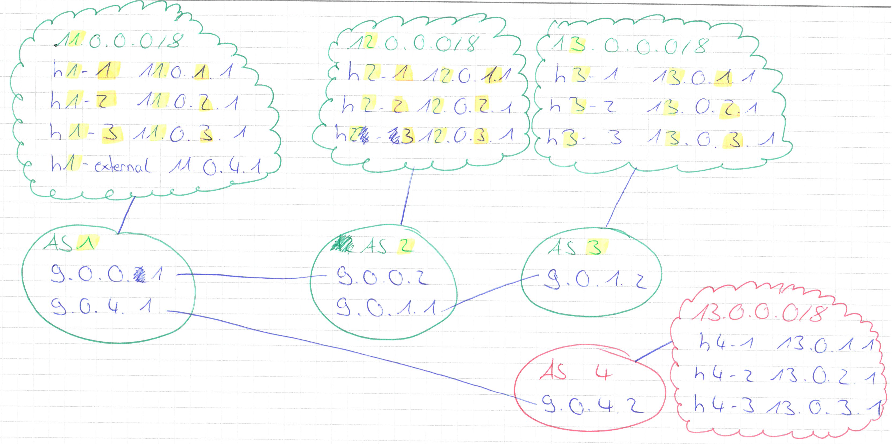

# bgp

This tutorial extends [BGP Path Hijacking Attack Demo](https://github.com/mininet/mininet/wiki/BGP-Path-Hijacking-Attack-Demo). You can find the original [source code](https://bitbucket.org/jvimal/bgp/src/789055b95a666f0585e5eee67fbdb30876ab06ec?at=master) on Bitbucket.

It adds an additional host with the ip address *11.0.4.1* to *AS1* (gateway: *11.0.4.254*). This host is **not** running in mininet and has to be connected to a real network interface connected to the virtual machine.

Furthermore, it starts CryptoPingServers on *h3-2 (13.0.2.1:10008)* and *h4-2 (***13***.0.2.1:10008)*. Due to the fact that mininet hosts share the same directories, separate public and private keys are generated depending on the hosts.

> Tested with Paralles Desktop 12.2.1

## Setup
Download the latest [Mininet VM](https://github.com/mininet/mininet/wiki/Mininet-VM-Images).
Connect an additional network interface as a host-only network to the virtual machine.

Login credentials are the following:

username: `mininet`<br/>
password: `mininet`


Then clone this repository and install the necessary dependencies with

`$ ./install.sh`.

Run mininet with

`$ sudo python bgp.py --iface eth1`.

Replace *eth1* with the name of your additional network interface. If no parameter is given, mininet will start without connecting an external controller.

Then, you need to find out the corresponding name of the network interface on your **host machine** (e.g. *vnic1*). Set the ip address of the interface to *11.0.4.1/24* and make *11.0.4.254* the gateway for the following nets: *11.0.0.0/8*, *12.0.0.0/8*, *13.0.0.0/8*. On macOS, this can be done with the following commands:

```
$ sudo ifconfig vnic1 11.0.4.1 netmask 255.255.255.0

$ sudo route -n add 11.0.0.0/8 11.0.4.254
$ sudo route -n add 12.0.0.0/8 11.0.4.254
$ sudo route -n add 13.0.0.0/8 11.0.4.254
```

